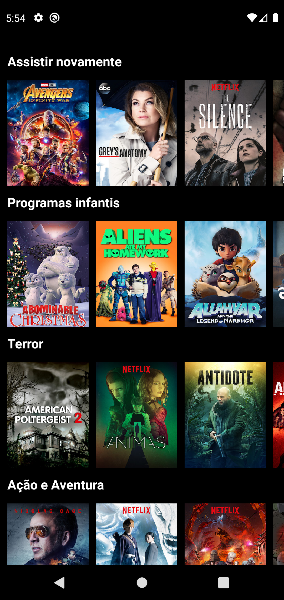
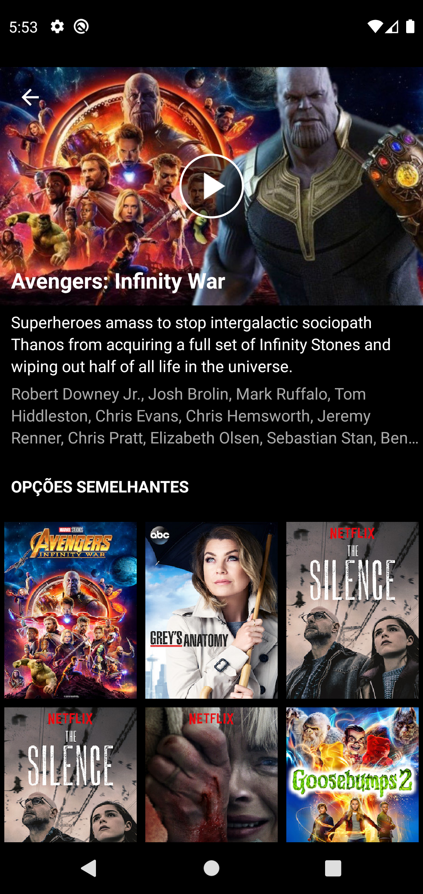

# Netflix UI Clone
 Android study replicating the Netflix app interface to improve knowledge on 
 Nested Recycler View, Constraint Layout, Java, http requests without using external code, multiple activities,
 Custom vector assets, permissions, custom drawables, etc.

# :pushpin: Table of Contents

* [Features](#brain-features)
* [Technologies](#computer-technologies)

# :brain: Features

* List categories
* List movies by categories
* Movie details

# :computer: Technologies

* Android
* Java
* XML
